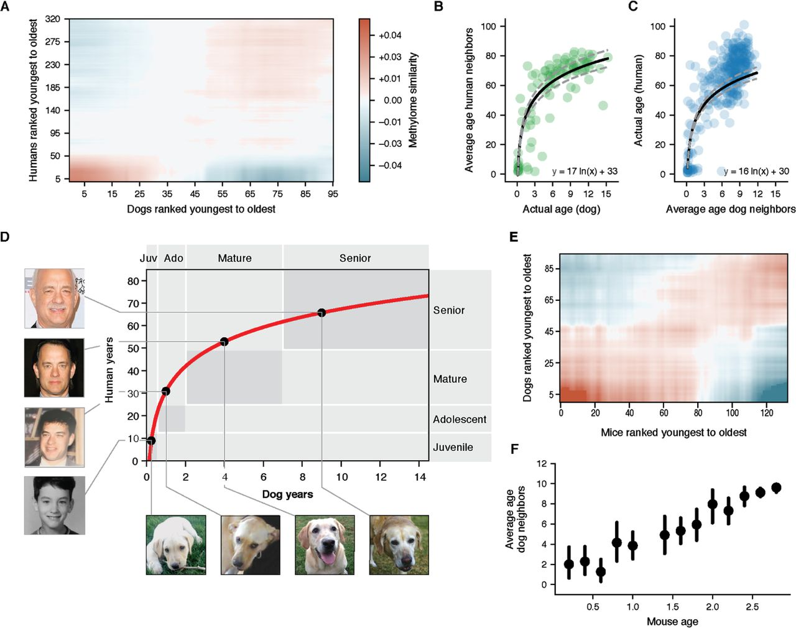

# Calc Pet Bday

A simple web application to calculate the birthdays of your pets (dogs and cats). This tool provides an enjoyable way to understand how your pets' ages translate into human years, while allowing you to view both their upcoming and past birthdays.


## Project Links

- [Live Application](https://calc-pet-bday.ru)
- [Backup link](https://calc-pet-bday.netlify.app)

## Table of Contents

- [Features](#features)
- [How It Works](#how-it-works)
  - [Dog Age Calculation](#dog-age-calculation)
  - [Cat Age Calculation](#cat-age-calculation)
  - [Aging Rates](#aging-rates)
- [Usage](#usage)
- [Contact](#contact)

## Features

- Calculates the birthdays of your pets based on their birth dates.
- Provides a clear conversion of pet ages (in years) to human years for both dogs and cats.
- Displays a list of upcoming and past birthdays for your pets.

## How It Works

The application allows users to input their pet's birth date and type (dog or cat). It then calculates the corresponding human years and upcoming and past birthdays. The calculations are based on specific formulas tailored to each pet type.

### Dog Age Calculation

For dogs, the age calculation is based on a logarithmic formula derived from scientific research. The formula used is:

```js
human_age = 16 ln(dog_age) + 31
```


This approach reflects the faster aging process of dogs compared to humans, especially during their early years. The study suggests that the logarithmic relationship between dog years and human years provides a more accurate estimation of a dog's age in human terms, particularly for different breeds and sizes of dogs.



You can read more about this calculation in the research paper: [Canine Age and Life Expectancy: A Novel Method to Estimate the Human Age of Dogs](https://www.biorxiv.org/content/10.1101/829192v1.full).

### Cat Age Calculation

For cats, the age conversion is simpler and based on standard age equivalents:

- 1 year = 15 cat years
- 2 years = 9 cat years
- Each additional year = 4 cat years

This method is more straightforward as it reflects the typical aging process of cats, which tends to be less variable than that of dogs.

### Aging Rates

The aging rates for dogs and cats are different at each stage of their life. Here is an overview of aging rates for both species.

**Dog aging rates:**
```js
[31, 11, 7, 4, 4, 3, 2, 2, 2, 2, 1, 2, 1, ...]
```

**Cat aging rates:**
```js
[15, 9, 4, 4, 4, ...]
```

This table shows how animals' aging progresses through the years, illustrating the differences in their aging processes.

## Usage

1. Enter your pet's birth date.
1. Select the type of pet (dog or cat).
1. Click the "Calculate" button to see the upcoming and past birthdays and age conversions.

## Contact

If you have any questions, suggestions, or collaboration ideas, you can reach me directly via email at 2499931@gmail.com. I'd love to hear your feedback!

Best regards,
Andrey Kudinov

Made with ❤️

#### Do you like "Calc Pet Bday"? Please star ⭐ this repository!